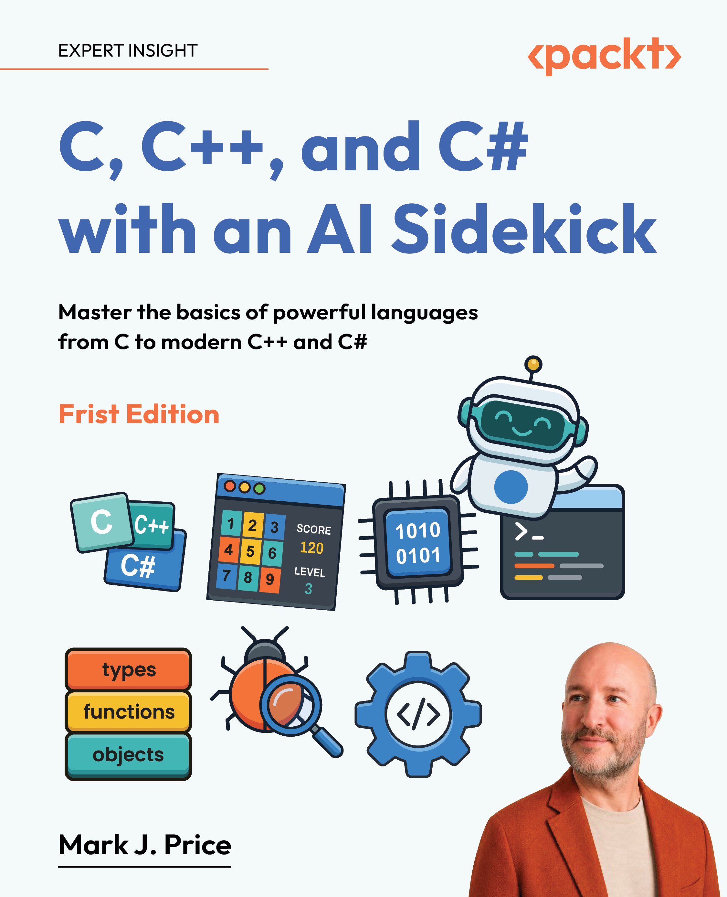

> **IMPORTANT!** [Common Mistakes, Improvements, and Errata aka list of corrections](docs/errata/README.md)

# C, C++, and C# with an AI Sidekick, First Edition

Repository for the Packt Publishing book titled *C, C++, and C# with an AI Sidekick* by Mark J. Price.

> **[FAQs](https://github.com/markjprice/markjprice/blob/main/FAQs.md)**

- [C, C++, and C# with an AI Sidekick, First Edition](#c-c-and-c-with-an-ai-sidekick-first-edition)
- [Free PDF/ePub of the book and how to contact the publisher Packt](#free-pdfepub-of-the-book-and-how-to-contact-the-publisher-packt)
- [Author's books](#authors-books)
- [Chapters and code projects](#chapters-and-code-projects)
  - [Part 1: Introduction](#part-1-introduction)
  - [Part 2: C – Language Foundations and Manual Memory Management](#part-2-c--language-foundations-and-manual-memory-management)
  - [Part 3: C++ – Improving Abstraction, Safety, and Power](#part-3-c--improving-abstraction-safety-and-power)
  - [Part 4: C# – Modernizing Productivity and Managed Memory](#part-4-c--modernizing-productivity-and-managed-memory)
  - [Part 5: Blazor and Unity - Building Games with C#](#part-5-blazor-and-unity---building-games-with-c)
  - [Epilogue and Appendix](#epilogue-and-appendix)
- [Online content](#online-content)
- [Book Cover](#book-cover)

# Free PDF/ePub of the book and how to contact the publisher Packt

The next-gen online **Packt Reader** and a **free PDF/ePub copy** of this book are included with your purchase. Visit https://packtpub.com/unlock, then use the search bar to find this book by name. Double-check the edition shown to make sure you get the right one.

For questions about book pricing, distribution, and so on, please contact the publisher Packt at the following email address: customercare@packt.com

# Author's books

My author page on Amazon: https://www.amazon.com/Mark-J-Price/e/B071DW3QGN/ 

All of my books on Packt's website: https://subscription.packtpub.com/search?query=mark+j.+price

My author page on Goodreads: https://www.goodreads.com/author/show/14224500.Mark_J_Price

# Chapters and code projects

## Part 1: Introduction
- Chapter 1, Introducing C, C++, and C#: [code/Chapter1](https://github.com/markjprice/c-cpp-cs/tree/main/code/Chapter01)
- Chapter 2, Learning and Coding with AI

## Part 2: C – Language Foundations and Manual Memory Management
- Chapter 3, C Fundamentals: [code/Chapter3](https://github.com/markjprice/c-cpp-cs/tree/main/code/Chapter03)
- Chapter 4, C Memory Management: [code/Chapter4](https://github.com/markjprice/c-cpp-cs/tree/main/code/Chapter04)
- Chapter 5, C Limitations: [code/Chapter5](https://github.com/markjprice/c-cpp-cs/tree/main/code/Chapter05)

## Part 3: C++ – Improving Abstraction, Safety, and Power
- Chapter 6, C++ Fundamentals: [code/Chapter6](https://github.com/markjprice/c-cpp-cs/tree/main/code/Chapter06)
- Chapter 7, C++ Object-Oriented Programming: [code/Chapter7](https://github.com/markjprice/c-cpp-cs/tree/main/code/Chapter07)
- Chapter 8, C++ Memory Management: [code/Chapter8](https://github.com/markjprice/c-cpp-cs/tree/main/code/Chapter08)

## Part 4: C# – Modernizing Productivity and Managed Memory
- Chapter 9, C# Fundamentals: [code/Chapter9](https://github.com/markjprice/c-cpp-cs/tree/main/code/Chapter09)
- Chapter 10, C# Object-Oriented Programming: [code/Chapter10](https://github.com/markjprice/c-cpp-cs/tree/main/code/Chapter10)
- Chapter 11, C# Modern Programming: [code/Chapter11](https://github.com/markjprice/c-cpp-cs/tree/main/code/Chapter11)
- Chapter 12, C# Memory Management and Resource Lifetime: [code/Chapter12](https://github.com/markjprice/c-cpp-cs/tree/main/code/Chapter12)
- Chapter 13, C# High-Performance Memory and Diagnostics: [code/Chapter13](https://github.com/markjprice/c-cpp-cs/tree/main/code/Chapter13)

## Part 5: Blazor and Unity - Building Games with C#
- Chapter 14, Introducing Game Development with C#
- Chapter 15, Building the Puzzle Arcade Shell: [code/Chapter15](https://github.com/markjprice/c-cpp-cs/tree/main/code/Chapter15)
- Chapter 16, Building Word Guess and Number Logic: [code/Chapter16](https://github.com/markjprice/c-cpp-cs/tree/main/code/Chapter16)
- Chapter 17, Modeling Boards and Tile Actions: [code/Chapter17](https://github.com/markjprice/c-cpp-cs/tree/main/code/Chapter17)
- Chapter 18, AI-Assisted Variations, Testing, and Review: [code/Chapter18](https://github.com/markjprice/c-cpp-cs/tree/main/code/Chapter18)
- Chapter 19, Hand-Crafting a 3D Game in Unity: [code/Chapter19](https://github.com/markjprice/c-cpp-cs/tree/main/code/Chapter19)
- Chapter 20, Improving a Unity Game with AI Assistance: [code/Chapter20](https://github.com/markjprice/c-cpp-cs/tree/main/code/Chapter20)

## Epilogue and Appendix

**Appendix**
- [*Appendix, Answers to the Test Your Knowledge Questions*](docs/B33445_Appendix%20A.pdf)
- Appendices are included with your purchase. Visit https://packtpub.com/unlock, then use the search bar to find this book by name. Double-check the edition shown to make sure you get the right one.

# Online content

- [Common Mistakes, Improvements, and Errata aka list of corrections](docs/errata/README.md)
- [Command-Lines](docs/command-lines.md) page lists all commands as a single line that can be copied and pasted to make it easier to enter commands at the prompt.
- [Prompts](prompts/readme.md)
- [Book Links](docs/book-links.md)

# Book Cover

