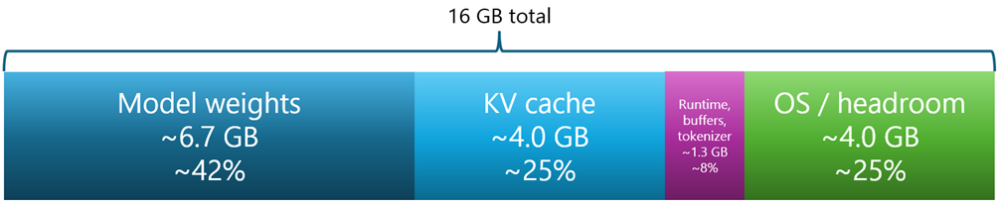

# Why the model file size is not the memory requirement

A model’s parameter count tells you how many learned numbers it contains. The raw memory for those numbers is roughly: `parameters × bytes per parameter`.

This is why a 12B model can be impossible in BF16 on a 16 GB GPU, but workable in 4-bit quantized form. Google’s Gemma 4 table shows this clearly: Gemma 4 12B is estimated at 26.7 GB in BF16, 13.4 GB in SFP8, and 6.7 GB in Q4_0. Google also notes that these figures are for loading the model weights and do not include the context window or supporting software.

> **Good practice**: Remember that the downloaded file or base weight estimate is only the starting point. At runtime, memory is also used by: the inference engine, GPU kernels, tokenizer, temporary buffers, output buffers, tool-calling structures, vision/audio encoders for multimodal models, and the key-value cache used for the context window.

For local coding agents, the key-value cache is often the hidden cost.

## The context window and the KV cache

When a model generates text, it does not reread the whole prompt from scratch for every new token. Instead, transformer models cache internal attention data for previous tokens. This is called the key-value cache, or KV cache. NVIDIA describes the two main contributors to inference memory as model weights and the KV cache, and gives the general cache formula in terms of batch size, sequence length, number of layers, hidden size, and precision.

A simplified version is:
```
KV cache memory = batch size × context tokens × 2 × layers × KV hidden size × bytes per value
```

The factor of 2 is because the cache stores both keys and values. The important practical result is that KV cache memory grows roughly linearly with context length. Doubling the context roughly doubles the KV cache.

Hugging Face’s Transformers documentation explains that KV caches avoid recomputing previous attention values and that different cache implementations trade memory for speed. A dynamic cache grows as generation proceeds; a static cache can be faster with compilation but may use more memory because it pre-allocates a maximum cache size; a quantized cache uses less memory.

For readers, the lesson is: A model with a 128K or 256K context window does not mean your computer can use that full context comfortably.

For example, a 4-bit 8B model might fit easily in 8 GB to 12 GB of VRAM for short chat. But if you ask for 128K context, the KV cache can consume many more gigabytes. A coding agent makes this worse because it may load project files, error logs, test output, previous conversation history, tool-call results, and generated patches into the prompt.

## Why coding agents need more memory than chat

A simple chatbot prompt might contain a question and a short answer. A coding-agent prompt might contain all of this: the system prompt, coding rules, the user request, repository tree, selected source files, package files, compiler errors, test failures, documentation snippets, tool schemas, previous tool outputs, and the patch it is currently drafting.

That can easily reach 32K, 64K, or 128K tokens. A model that is excellent for short chat on a 16 GB GPU may become slow or run out of memory when used as a coding agent.
Good practice: Do not chase the maximum advertised context length. A smaller, faster model at 16K or 32K context is often more useful than a larger model running painfully slowly at 128K.

## Practical rules of thumb

For simple chat, leave at least 20% of VRAM or unified memory free after loading the model. For coding assistance, leave 30% or more. For coding agents, be more conservative still.

For example, to load Gemma 4 12B on 16 GB hardware, you should limit your model choice to a 4-bit quantized model because you will need at least double the expected RAM, as shown in *Figure 2.2*:


*Figure 2.2: Memory usage for a typical local model*

In the preceding figure:
- Model weights is the compressed parameters loaded into memory
- KV cache is the memory used to remember previous tokens in the context window
- Runtime, buffers, tokenizer are the inference engine, temporary buffers, and support overhead
- OS and headroom is the memory left over for stability and to avoid out-of-memory (OOM) errors

The key takeaway is that a 12B model may fit on 16 GB hardware in 4-bit form, but the model file is only part of the story. You must also budget for KV cache, runtime overhead, and free headroom, especially for coding agents with long context windows.

Use 4-bit quantization for local experimentation unless you have a strong reason not to. Q4 is usually the best first choice because it makes capable models practical on consumer hardware. Move up to Q5, Q6, Q8, or BF16 only when you have enough memory and need better quality.

Prefer smaller models with more context over larger models with tiny context for coding-agent workflows. A 12B model with 32K usable context may be more useful than a 30B model squeezed into memory with only 4K or 8K context.

For Mixture-of-Experts models, do not confuse active parameters with loaded parameters. Qwen3-Coder-30B-A3B activates about 3.3B parameters per token, but the model has 30.5B total parameters. Gemma 4 26B A4B similarly activates fewer parameters per token, but Google notes that all 26B parameters must be loaded for fast routing and inference.

For local coding agents, use a retrieval or file-selection workflow instead of dumping the whole project into the prompt. Better tools select the relevant files, summarize older context, and keep the prompt focused. This saves memory and often improves answer quality.

## A reader-friendly appraisal checklist

Before downloading a local model, check the details described in *Table 2.3*:

Question|Why it matters
---|---
How many parameters does it have?|Larger models usually know more and reason better, but require more memory and compute.
Is it dense or MoE?|Dense models use most parameters every token. MoE models activate fewer parameters per token, but often still need all weights loaded.
What quantization will you use?|Q4 may fit where BF16 will not.
How much VRAM or unified memory do you have?|GPU memory is usually the main limit for speed.
What context length will you actually use?|Long context can add many gigabytes of KV cache.
Is it for chat, code completion, or an agent?|Agents need much more context and tool memory than chat.
Does your local runtime support the model well?|New architectures may need recent versions of Ollama, LM Studio, llama.cpp, MLX, vLLM, SGLang, or Transformers.
Can you reduce context if it fails?|Many out-of-memory problems are fixed by lowering context length.

**Table 2.3: Local model checklist**

A good beginner recommendation is: start with a 4-bit model that uses no more than half to two-thirds of your available VRAM or unified memory. Then increase the context length gradually until the machine becomes slow or unstable. That is the most important lesson: local AI performance is not only about the model. It is the model plus quantization plus runtime plus context window plus workload.
