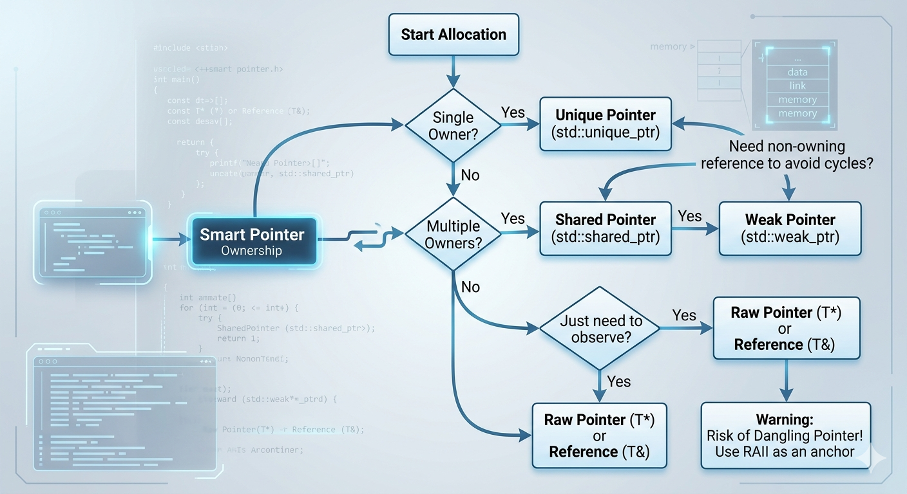

> **Prompt**: When should I use unique_ptr vs shared_ptr vs weak_ptr? Please include a drawing of an ownership decision tree diagram (unique vs shared vs weak) so that I can understand visually.

Choosing the right smart pointer is about defining **ownership**. In C++, a raw pointer (`T*`) is just an address; it doesn't tell the compiler who is responsible for cleaning up the memory. Smart pointers make that responsibility explicit.

---

## 1. `std::unique_ptr<T>` (Exclusive Ownership)
This is the "default" smart pointer. It represents a **1-to-1 relationship**: one pointer owns one object.

* **When to use it:** For 90% of your heap allocations. Use it for local variables within a function or as private members of a class.
* **The Rule:** It cannot be copied, only **moved**. This ensures that there is never any confusion about who should delete the memory.
* **Performance:** Zero overhead. It is as fast and small as a raw pointer.

---

## 2. `std::shared_ptr<T>` (Shared Ownership)
This represents a **Many-to-1 relationship**. Multiple pointers can own the same object.

* **When to use it:** When you have a resource (like a texture in a game or a shared configuration file) that multiple unrelated parts of your code need to access, and you don't know which one will finish with it last.
* **How it works:** It maintains a **Reference Counter**. The object is only deleted when the very last `shared_ptr` pointing to it is destroyed.
* **Performance:** Moderate overhead. It requires an atomic counter, which is slightly slower than a unique pointer.

---

## 3. `std::weak_ptr<T>` (Non-Owning Observer)
This is a "viewer" for a `shared_ptr`. It can look at the object but doesn't contribute to the reference count.

* **When to use it:**
    1.  **Breaking Cycles:** If Object A has a `shared_ptr` to B, and B has one to A, they will never be deleted (a memory leak). Making one of them a `weak_ptr` breaks this cycle.
    2.  **Caches:** When you want to check if an object still exists without forcing it to stay alive.
* **How to use it:** You must call `.lock()` to temporarily convert it to a `shared_ptr` to ensure the object hasn't been deleted while you're using it.

---

## Decision Decision Tree

| If you need... | Use... |
| :--- | :--- |
| **A single owner** (Most cases) | `std::unique_ptr` |
| **Multiple owners** | `std::shared_ptr` |
| **To observe without owning** | `std::weak_ptr` |
| **A temporary "look" (no ownership)** | `Raw Pointer (T*)` or `Reference (T&)` |

**A good rule of thumb:** Always start with `unique_ptr`. Only "upgrade" to `shared_ptr` if you can prove that multiple objects truly need to share the lifetime of the resource.

## Visually: The Smart Pointer Decision Tree

This diagram walks you through the logical questions you should ask yourself when designing your ownership model.

## Final Recap

- `unique_ptr`: Default Choice. Maximum speed, absolute safety. Use for 90% of heap memory.
- `shared_ptr`: For truly shared resources (caches, multi-threading). Cost is atomic reference counting.
- `weak_ptr`: For observations where you don't need ownership, and to prevent cycles between shared_ptrs.

By using the correct smart pointer, you make your code's architecture clear and let the compiler enforce the memory management rules you've defined.